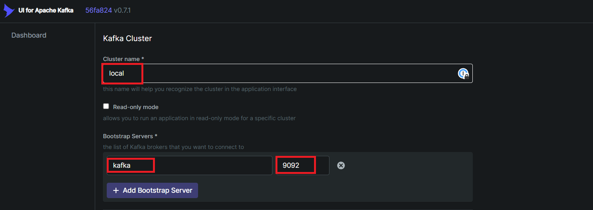
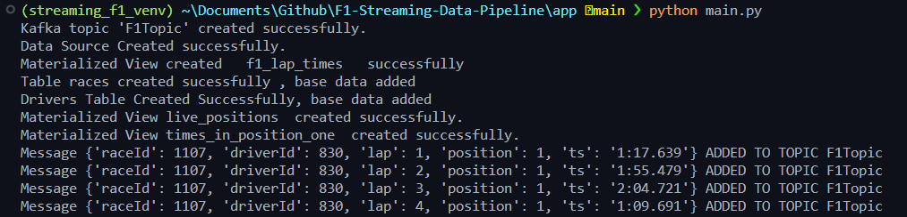
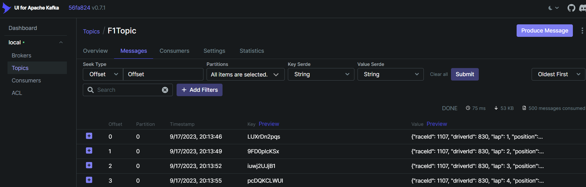
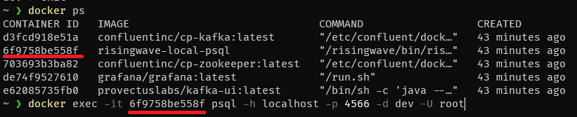
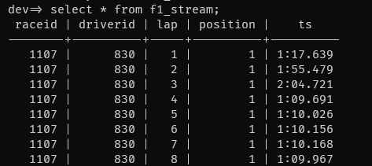
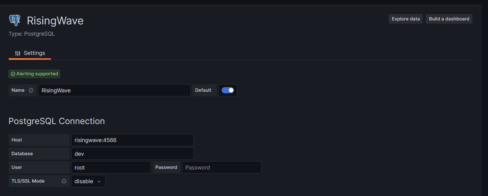
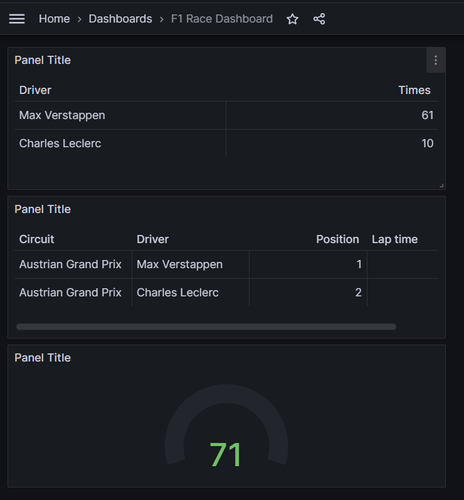

# _Formula 1 Data Streaming - Analytics_


_This project is designed to collect, process, and visualize telemetry data from Formula 1 races using various technologies. The incoming UDP packets from the race are categorized into two distinct data streams: Persistent Data and Real-Time Data._ 


<div style="text-align:center;">
  
</div>


## Technologies Used

The Formula 1 Streaming Data Pipeline project leverages a combination of cutting-edge technologies to deliver real-time data processing and visualization:

- **Formula 1 Data Source**: The project relies on the Formula 1 dataset obtained from ErgastAPI. This dataset serves as the primary source of Formula 1 race data for real-time streaming and visualization.

- **Kafka**: Kafka is a foundational element of this streaming pipeline, serving as a robust distributed data streaming platform. 

- **RisingWave (Streaming Database)**: RisingWave serves as the core streaming database, efficiently storing and managing real-time Formula 1 data.

- **Grafana Dashboard**: To visualize live Formula 1 data dynamically, Grafana is employed. It provides a versatile platform for creating customized dashboards, real-time charts, and data visualization tools. 

- **Kafka UI**: Offers user-friendly graphical interfaces for efficient Kafka topic inspection, simplifying the tracking and comprehension of data flow within the streaming pipeline.


### Setup

Create RisingWave Docker Image with *postgresql-client*

```
docker build -t risingwave-local-psql .
```


```
docker-compose up -d
```

The docker-compose up -d command initializes and starts all the specified services and containers within the project's Docker Compose configuration. It orchestrates the setup of various components, including ZooKeeper, Kafka, Kafka UI, RisingWave, and Grafana, by launching them in detached mode.


Connect to a **KAFKA-UI** at *localhost:8080*, and set **Cluster name**, and **Kafka Service** + **Port** then Click Submit
<div style="text-align:center;">
  
</div>


Setup Python Virtual Environment with dependencies inside **requirements.txt**

This Python script sets up most of the manual steps for  **Kafka** and **RisingWave**. It creates **Kafka topics**, establishes a **data source**, and sets up **materialized views** for real-time analytics.
The script also initializes tables for races and drivers, adding base data. Additionally, it generates materialized views for live positions and lap times in the first position. These views enable real-time monitoring and analysis of Formula 1 race data. 

```
cd /app
python main.py
```
<div style="text-align:center;">
  
</div>
<br>
We can see that messages are arriving inside the Kafka-UI

<div style="text-align:center;">
  
</div>

<br>
We can manually check the data inside the database within the container
<div style="text-align:center;">
  
</div>
<br>

```
docker exec -it *CONTAINER ID* psql -h localhost -p 4566 -d dev -U root
```

<div style="text-align:center;">
  
</div>


## Data Visualization
Head to *localhost:3000*

Navigation inside Grafana: Home -> Connections -> Add new connection -> PostgreSQL -> Add new data source

Add the conection to RisingWave Database
<div style="text-align:center;">
  
</div>

<br>
Import the Dashboard F1 Race Dashboard.json
<br>


<div style="text-align:center;">
    <p align="center">
  
    </p>
</div>

The streaming data pipeline is now fully operational, python script efficiently streams data through the Kafka topic, while the RisingWave streaming database processes and merges data in real-time.


Complete Data Flow Architecture:
Real-Time Data:
Game Data → Kafka → Flink or Kafka Streams → Grafana (via WebSocket for real-time metrics).
Long-Term Data:
Game Data → Kafka → Kafka Connect / NiFi → PostgreSQL → Superset (for long-term visualization and analysis).

# TODO: Checking the psql
```bash
docker exec -it postgres bash
psql -U superset -d superset_db


```