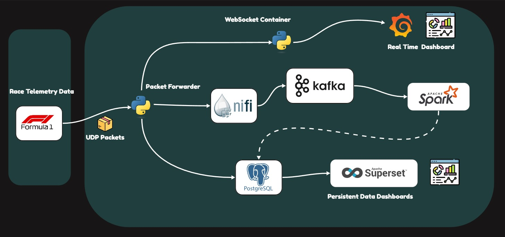

# _Formula 1 Telemetry - Data Streaming - Analytics_

_This project is designed to collect, process, and visualize telemetry data from Formula 1 races using various technologies. The incoming UDP packets from the race are categorized into two distinct data streams: Persistent Data and Real-Time Data._ 

  

_All F1 Simulation racing series can export race telemetry data in form of UDP Packets. General specification where followed from [***F1 Official UDP Packets***](https://answers.ea.com/t5/General-Discussion/F1-24-UDP-Specification/m-p/13745220/thread-id/2650/highlight/true)_

## Arhitecture Overview
The project integrates multiple services to collect, process, and visualize telemetry data from Formula 1 races. This data is categorized into two main types:

***Real-Time Data*** : Telemetry data such as car speed, lap times, fuel levels, and battery status is processed and visualized in real-time.

 A central Python application captures telemetry packets from the game, listening on `localhost:20777`. Key data fragments are immediately forwarded to a WebSocket service, where they are displayed in Grafana, providing instant insights during the race.

***Persistent Data (Stored in PostgreSQL)***: Telemetry data is directed to Apache NiFi, which routes the packets to specific Kafka topics. Spark processes this data and relays it to ***PostgreSQL*** for long-term storage. 

Additionally, some telemetry packets, specifically those tied to the current driver's session, are stored directly in PostgreSQL to capture session-specific details.